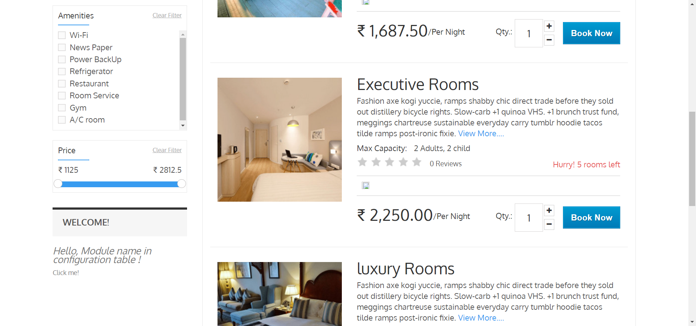
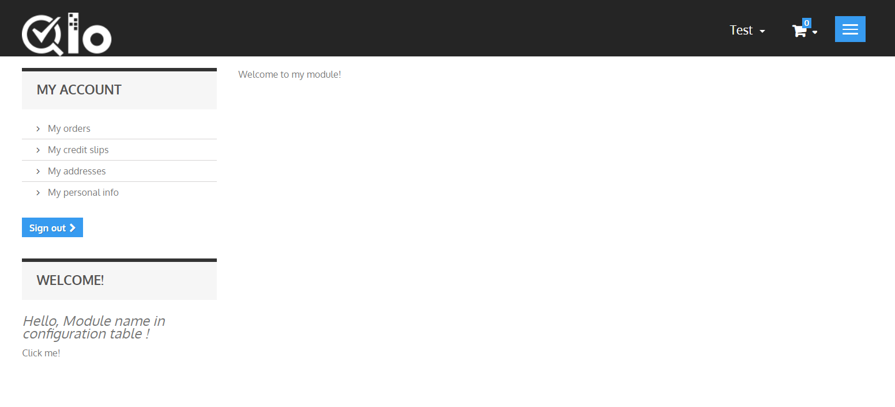

# How to display content on the front office

In order to display your module content on the front, you need to add a few hook support. This can be done by implementing the hooks' method which is done in the install()) method, using the registerHook() method:

```php
public function install()
{
  return parent::install()
    || !$this->registerHook('displayLeftColumn')
    || !$this->registerHook('actionFrontControllerSetMedia')
    || !Configuration::updateValue('MYQLOMODULE_NAME', 'Module name in configuration table');
}
```
In the above code block, we can see that the module is hooked to the "leftColumn" and "header" hooks. In addition to this, we can also add code for the "rightColumn" hook.

Attaching code to a hook requires a specific method for each:

- `hookDisplayLeftColumn()`: it will execute the code into the left column hook  – in the above-discussed case, it will fetch the MYQLOMODULE_NAME module setting and display the module's template file module.tpl, which must be located in the /views/templates/hook/ folder.
- `hookDisplayRightColumn()`: it will simply do the same as hookDisplayLeftColumn(), but for the right column.
- `actionFrontControllerSetMedia()`: it will add a media files (CSS, js) into the page header

```php
public function hookDisplayLeftColumn($params)
{
  $this->context->smarty->assign(
      array(
          'my_module_name' => Configuration::get('MYQLOMODULE_NAME'),
          'my_module_link' => $this->context->link->getModuleLink('myqlomodule', 'display')
      )
  );
  return $this->display(__FILE__, 'mymodule.tpl');
}
   
public function hookDisplayRightColumn($params)
{
  return $this->hookDisplayLeftColumn($params);
}
   
public function hookActionFrontControllerSetMedia()
{
  $this->context->controller->addCSS($this->_path.'/views/css/mymodule.css', 'all');
}  
```

We are using the Context (`$this->context`) to access Smarty object and assign variables to templates: Smarty's assign() method makes it possible for us to set the template's name variable with the value of the MYQLOMODULE_NAME setting stored in the configuration database table.

The set media hook enables to add of media in the `<head>` tag of the generated HTML file. This is very useful for JavaScript or CSS files. To add a link to our CSS file in the page's `<head>` tag, we use the `addCSS()` method, which generates the correct `<link>` tag to the CSS file indicated in parameters. To add js files use `addJs()` method similarly to `addCSS()`.

Save your file, and now you can hook your module's template into the theme, move it around and transplant it (even though there is not template file for the moment): go to the "Positions" page from the "Modules" menu in the back office, then click on the "Transplant a module" button (top right of the page).

In the transplantation form:
1) Find "My module" in the "Module" drop-down list.
2) Choose "(displayLeftColumn) Left column blocks" in the "Hook into" drop-down list.
3) Click "Save".

The "Positions" page should reload, with the following message: "Module transplanted successfully to hook" (or maybe "This module has already been transplanted to this hook. "). Congratulations! Scroll down the "Positions" page, and you should indeed see your module among the other modules in the "Left column blocks" list. Move it to the top of the list by drag'n'dropping the module's row.

The module is now attached to the left column... but without any template to display, it falls short of doing anything useful: if you reload the homepage, the left column simply displays a message where the module should be, saying "No template found for module mymodule".


## Displaying content
Now that we have attached our module to the left column, we should display something there for the customer to see.

The visible part of the module is defined in .tpl files placed in specific View folders:

- */views/templates/front/* : front office views.
- */views/templates/admin/* : back office views.
- */views/templates/hook/* : views used in a hook (so can be displayed either on the front office or the back office).
   

Template files can have just about any name. If there is only one such file, it is good practice to give it the same name as the folder and main file: mymodule.tpl.
In the case of this tutorial, the module will be hooked to the left column. Therefore, the TPL files that are called from the hook method should be placed in `/views/templates/hook/` to work properly.

```php
public function hookDisplayLeftColumn($params)
{
  $this->context->smarty->assign(
      array(
          'my_module_name' => Configuration::get('MYQLOMODULE_NAME'),
          'my_module_link' => $this->context->link->getModuleLink('myqlomodule', 'display')
      )
  );
  return $this->display(__FILE__, 'mymodule.tpl');
}
```

We will create the mymodule.tpl file, which was passed as a parameter of the display() method in our module's code, in the `hookDisplayLeftColumn()` method. QloApps will look for that template file in the `/views/templates/hook/` folder (in the module's folder), which you must create yourself.

Here is our template file, located at `/views/templates/hook/mymodule.tpl`:

``` html
<!-- Block mymodule -->
<div id="mymodule_block_home" class="block">
  <h4>Welcome!</h4>
  <div class="block_content">
    <p>{l s='Hello' mod='myqlomodule'},
       {if isset($my_module_name) && $my_module_name}
           {$my_module_name}
       {else}
           {l s='World' mod='myqlomodule'}
       {/if}
       !       
    </p>   
    <ul>
      <li><a href="{$my_module_link}" title="Click this link">{l s='Click me!' mod='myqlomodule'}</a></li>
    </ul>
  </div>
</div>
<!-- /Block mymodule -->
```
This is just regular HTML code... except for a few Smarty calls:

The {l s='xxx' mod='yyy'} call is a QloApps-specific method that allows the string to be translated in the module's translation panel. The 's' parameter is the string, while the 'mod' parameter must contain the module's identifier (in the present case, "myqlomodule"). In practice, it should be used on all of the template's strings.

The {if}, {else} and {/if} statements are Smarty conditionals. In our example, we check that the $my_module_name Smarty variable exists (using PHP's isset() function, which is considered as trusted by Smarty) and that it is not empty. If it goes well, we display the content of that variable; if not, we display "World", to have "Hello World".
The `{$my_module_link}` variable in the link's href attribute: this is a Smarty variable that we will create later on, which will point to PrestaShop's root directory.

In addition to that, we are going to create a CSS file, and save it as `views/css/mymodule.css` in the module's folder:

``` css
div#mymodule_block_home p {
  font-size: 150%;
  font-style:italic;
}
```

Now reload your category page: the content of the template should appear on the left column (it will appear on the top if you have indeed moved it at the top of the "Left Column" hook during the transplanting part).



## Add New Page in the theme

The link that the module displays does not lead anywhere for now. Let's create the `display.php` file that it targets, with minimal content, and put it in the `/controllers/front/` directory.

Also we will have to create a template file to use the theme's style. Let's create the `display.tpl` as save it in the `views/templates/front` directory, which will contain the basic "Welcome to my module!" line, and will be called by `display.php`. That `display.php` file will be written as a front-end controller to properly embed our basic template within the theme's header, footer, columns, etc.

Here are our two files

``` php
<?php
class myqlomoduledisplayModuleFrontController extends ModuleFrontController
{
  public function initContent()
  {
    parent::initContent();
    $this->setTemplate('display.tpl');
  }
}
```
``` html
Welcome to my shop!
```

Let's explore display.php, our first QloApps front controller is stored in `/controllers/front/ ` folder of the module's main folder:

- A front controller must be a class that extends the ModuleFrontController class.
- That controller must have one method: `initContent()`, which calls the parent class' `initContent()` method...
- ...which then calls the `setTemplate()` method with our display.tpl file.

`setTemplate()` is the method that will take care of embedding our one-line template into a full-blown page, with the proper header, footer, and sidebars.

Save both files in their respective folders, and reload your shop's homepage, then click on the "Click me!", and voilà! You have your link. With just a few lines, the result is already much better, with the "Welcome" line neatly placed between the header, footer, and columns!



It is only a first step, but this gives you an idea of what is possible if you follow the templating rules.

