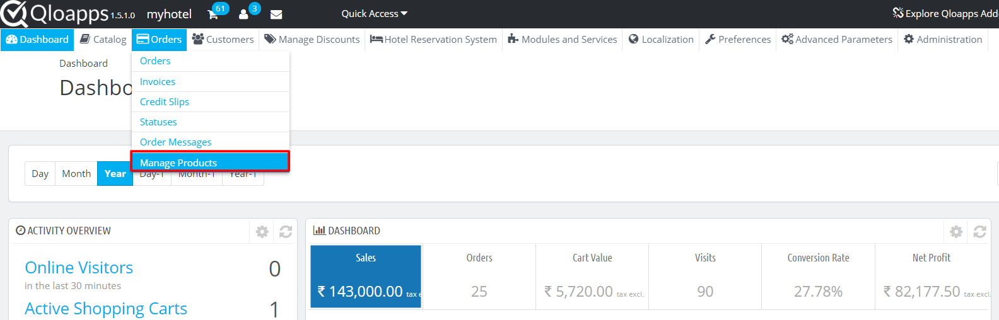
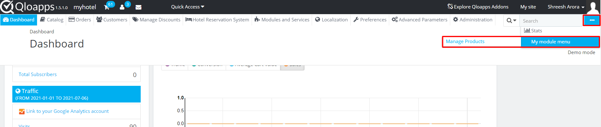

# Admin Controller


##  Create Tab for Admin Controller
To create an admin controller we will first need to create an entry of that admin controller’s class in `_DB_PREFIX_tab` table. And generally, we make all these entries at the time of module installation.

There are two options to create admin module controller:
- Create a tab in back office menu for the admin controller
- Create a hidden admin controller which can be opened through custom link.

For both these cases we will need to call `installTab()` function during module installation. we have created a `callInstallTab()` function which will handle all tab creation for multiple tabs.

```php
public function install()
{
    if (!parent::install()
        || !$this->registerHook('actionFrontControllerSetMedia')
        || !$this->registerHook('displayLeftColumn')
        || !Configuration::updateValue('MYQLOMODULE_NAME', 'Module name in configuration table')
        || !$this->createModuleTables()
        || !$this->callInstallTab()
    ) {
        return false;
    }

    return true;
}

/**
 * call installTab for all required admin controllers
 */
public function callInstallTab()
{
    $this->installTab('class_name', 'tab_name');
    return true;
}

/**
 * Creates entry for admin tab in QloApps database from provided arguments
 */
public function installTab($className, $tabName, $tabParentName = false, $hiddenTab = false)
{
    $tab = new Tab();
    $tab->active = 1;
    $tab->class_name = $className;
    $tab->name = array();

    foreach (Language::getLanguages(true) as $lang) {
        $tab->name[$lang['id_lang']] = $tabName;
    }

    if($hiddenTab) {
        $tab->id_parent = -1;
    } elseif ($tabParentName) {
        $tab->id_parent = (int) Tab::getIdFromClassName($tabParentName);
    } else {
        $tab->id_parent = 0;
    }

    $tab->module = $this->name;

    return $tab->add();
}
```

### Create a tab in back office menu for the admin controller

To create an admin controller with tab in back office, we will need to specify the `$tab_parent_name` for that controller. We have two options for creating admin controller with tabs.

**Create new tab inside previously created tab**

Suppose we want to add our admin controller inside Orders tab, our `installTab()` function call would be as below

```php
public function callInstallTab()
{
    $this->installTab('AdminMyModule', 'Manage Products', 'AdminParentOrders');
    return true;
}
```

This will create a new tab inside Orders tab




**Create a new menu in back office menu**

To create a new menu for for your module, we will need to pass false as `$tabParentName` for root tab.

```php
public function callInstallTab()
{
    $this->installTab('AdminParentMyModule', 'My module menu');
    $this->installTab('AdminMyModule', 'Manage Products', 'AdminParentMyModule');
    return true;
}

```

In the above example you can see that we have called an additional tab, this is because the parent tab will not be a controller. The controller `AdminMyModule` will be listed inside our parent tab.




### Create a hidden admin controller

To create a hidden admin controller we will need to pass $hiddenTab as true

```php
public function callInstallTab()
{
    $this->installTab('AdminMyModule', 'Manage Products', false, true);
    return true;
}
```

This will create a new entry in `_DB_PREFIX_tab` table but the tab will not be visible in back office menu. To access this admin controller create a link to this module and redirect to module.<br>
`$adminLink = $this->context->link->getAdminLink('AdminMyModule');`

We can assign this to smarty and create a link or we can redirect to this module on a function call.
```php
public function getContent()
{
    Tools::redirectAdmin($this->context->link->getAdminLink('AdminMyModule'));
}
```

In the above example when admin will click on config button the admin controller will be opened instead of configuration page.


## Create Admin controller

After creating tab for admin controller next step will be to declare admin controller. Lets create a controller file for AdminMyModule which will have controller in its suffix such as `AdminMyModuleController.php` and place the file in `/controller/admin` directory.

Our admin controller will be used to manage data in table `my_product_list`.

```php
class AdminAddHotelController extends ModuleAdminController
{
    public function __construct()
    {
        $this->bootstrap = true;
        $this->table = 'my_product_list';
        $this->className = 'MyProductList';
        $this->identifier = 'id';

        parent::__construct();

        $this->_join .= 'LEFT JOIN `'._DB_PREFIX_.'product_lang` pl
        ON (pl.`id_product` = a.`id_product` AND pl.`id_lang` = '.$this->context->language->id.')';
        $this->_join .= 'LEFT JOIN `'._DB_PREFIX_.'customer` c
        ON (c.`id_customer` = a.`id_customer`)';

        $this->_select = ' pl.`name` as room_type_name, CONCAT(c.`firstname`, ' ', c.`lastname`) as full_name';

        $this->fields_list = array(
            'id' => array(
                'title' => $this->l('ID'),
                'align' => 'center',
            ),
            'room_type_name' => array(
                'title' => $this->l('Room Type'),
                'align' => 'center',
                'filter_key' => 'pl!name',
            ),
            'full_name' => array(
                'title' => $this->l('Customer Name'),
                'align' => 'center',
            ),
            'active' => array(
                'align' => 'center',
                'title' => $this->l('Status'),
                'active' => 'status',
                'type' => 'bool',
                'orderby' => false,
            ),
        );
    }

    public function renderList()
    {
        $this->addRowAction('edit');
        $this->addRowAction('delete');

        return parent::renderList();
    }
}
```

When admin controller is loaded, the default view is a list containing the data inside the table declared in the controller.

Here is a line by line explanation:
1. `class AdminAddHotelController` every admin controller will extend `ModuleAdminController` which define the basic structure of the controller.
2. `$this->bootstrap = true;` it determine does this controller need to load bootstrap classes.
3. Next we define the table and its properties which the controller will use to fetch data and display in the list or for creating and editing data.
`$this->table` define the table from where data is to be fetched
`$this->className` define the ObjectModel class for that table. It is used to determine the structure of the table.
`$this->identifier` define the primary key colum of the table.
4. Sometimes we need to get data from other tables, for that use `$this->_join` statement to join current tables with other tables and use `$this->select` to get columns from joined tables.
By default the main table declared in the controller is aliased as 'a' keyword. In the example we have joined module table with product table and customer table in order to get customer name and room type name from `id_customer` and `id_product` respectively.
5. `$this->fields_list` define list display structure in admin module controller. here we have defined the coulums in the list along with their titles and there filter key used when applying filter in list.
6. `renderList()` function is used to add actions buttons in the list, using edit button we will open form page where we can edit or delete a specific tuple (row) from table.


