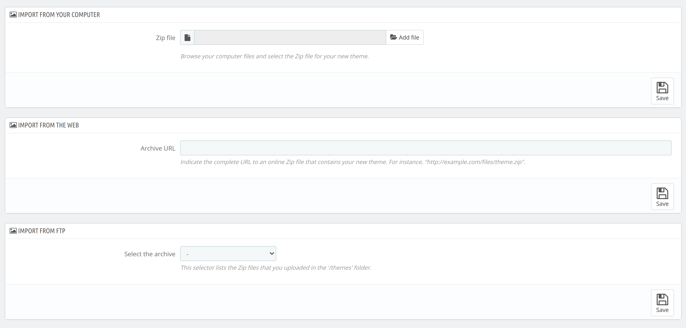

# Installing a Theme
After successfully creating a theme and exporting it as a zip file it is time now to install it and confirm if everything works as expected.

QloApps provides three methods of importing a theme. We are going to discuss each one in detail.

What method to choose depends on your accessibility of the theme zip file.

To install a theme follow the steps below:

1. Go to **Preferences** > **Themes**.
2. Click on **Add new theme** at the top right of the page.
3. You will be presented with three options to choose from as shown below:

- **IMPORT FROM YOUR COMPUTER**: If you have the file available on computer from where you are accessing back office.
- **IMPORT FROM THE WEB**: If you have the file available on some kind of online storage and have public access to it.
- **IMPORT FROM FTP**: If you have the file available on your server inside `/themes` folder.

4. Choose the appropriate method and click **Save**.
5. You will be notified for successful upload on the next page and your uploaded theme will be listed in the bottom section along with others.
6. Hover over your uploaded theme to show available options and then click **Use this theme**.
7. You will be redirected to the page asking you to select modules under following options:

- **Select the theme's modules you wish to install**: These are the modules which are included in this theme for installation.
- **Select the theme's modules you wish to enable**: These are the currently installed modules which will work properly with this theme.
- **Select the modules from the old hotel-reservation-theme theme that you wish to disable**: These are the modules that came with the previously installed theme.

Click **Show** to expand the corresponding list and tick/untick as required. Click **Save**.

8. If all goes well your theme will be installed and you will be notified about the same on the next page. If your theme came with a documentation click on the link to access the same.

If your themes uses different image sizes than the default themes, you may have to regenrate images to fit with your theme. If so, click on **Go to the thumbnails regeneration page** and regenrate applicable images for your theme.

Click **Finish**. Your new theme is now live! Click **My site** on nav bar to checkout the new theme!