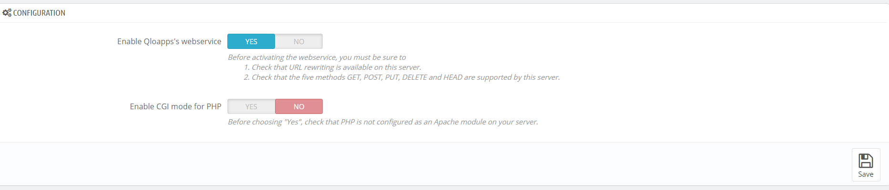

# Enable | Configure Webservice

To enable webservices in the QloApps you have to follow the below steps -

- In QloApps back office, open the tab "Webservice" under the "Advanced Parameters" menu. Then Enable the field "Enable Qloapps's webservice" under the "CONFIGURATION" panel.



- Click the "Add new webservice key" button to set the account configuration. A form will open and you have to fill below fields -

  - **Key** : You have to click on the "Generate" button to create an authentication key. You can also write by yourself but key must be 32 characters long. Using a generated key prevents from guessing the key. Using this key, you and other selected users will be able to access the web service.

  - **Key description** : The Key description is kind of a reminder for which this key is created and what accesses it provides. This is not public, but make sure to put all the keywords pertaining to its use, so that you can find the key more quickly.

  - **Status** : Through this option, you can disable this key any time. So you can provide accesses temporarily.

  - **Permissions** : This section enables you to assign accesses for each resource, you want to provide for this webservice key.
  You might give read, write and delete accesses of some resources And you only read access of some resources and no accesses of other resources. So this is how you can manage the rights of resources in webservices.
  Here you can select the resources you need to manipulate from your back-office.

**_If you create your custom webservice key, make sure it is very secure and that provided rights are limited_.**


You can also perform things programmatically. Below are some coding details to perform actions on QloApps webservice.

#### Enable or Disable the Webservice API

```php
// Enable webservice
Configuration::updateValue('PS_WEBSERVICE', 1);

// Disable webservice
Configuration::updateValue('PS_WEBSERVICE', 1);
```

#### Create API keys with WebserviceKey class

```php
$objWebserviceKey = new WebserviceKey();
$objWebserviceKey->key = 'CREATE_A_SECURE_AND_COMPLEX_VALUE_WITH_32_CHARACTERS';
$objWebserviceKey->save();
```

#### Grant permissions to resources

```php
// Let's give the permissions to address and customer resources
$permissions = [
  'addresses' => ['GET' => 1, 'POST' => 1, 'PUT' => 1, 'DELETE' => 0, 'HEAD' => 1],
  'customers' => ['GET' => 1, 'POST' => 1, 'PUT' => 0, 'DELETE' => 0, 'HEAD' => 1],
];

WebserviceKey::setPermissionForAccount($objWebserviceKey->id, $permissions);

// $objWebserviceKey->id is the id of the created web service access account
```